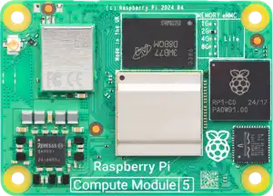
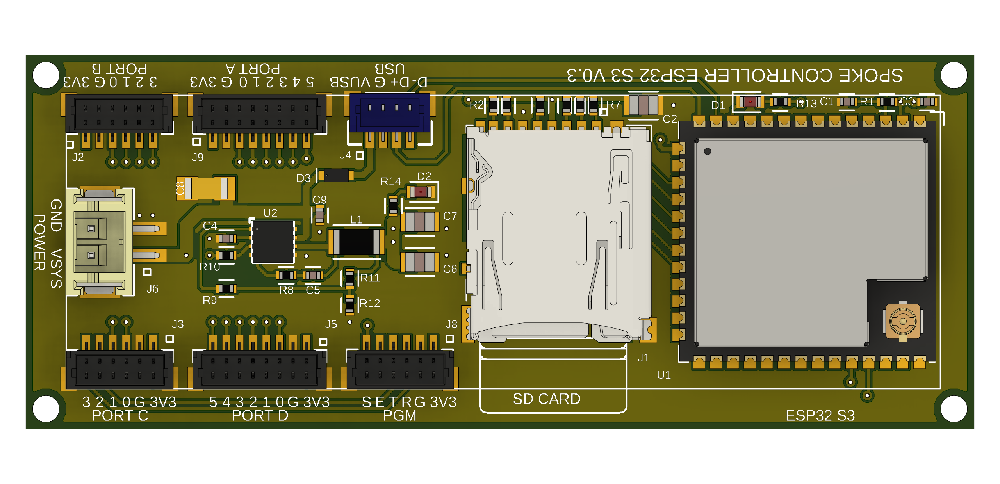
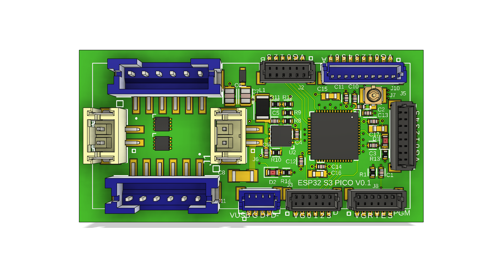

# Technology

# Structure

Robots can take many forms.  [Spoke Structure](/docs/spoke-structure/spoke-structure) is the system that permits robots to be constructed from open source, interchangeable, extendable parts.

  <LinkButton href="/docs/spoke-structure/spoke-structure" size="2">Spoke Structure</LinkButton>

# Compute

The critical core of the Robot is the main source of compute.  This is where larger AI algorithms run.  Typically these are Linux-based SBCs.

  <LinkButton href="/docs/spoke-compute/spoke-compute" size="2">Spoke Compute</LinkButton>

# Controllers

Inside the robot, local processing is handled by micro controllers.  These are connected to the main compute module via ethernet.  They are interconnected via micro network.

Where specialized processing is required, FPGAs can sometimes be the perfect solution.

  <LinkButton href="/docs/spoke-controller/spoke-controller" size="2">Spoke Controller</LinkButton>

# Peripherals

Robots need sensors and actuators.  These have low level interfaces that connect to controllers.

  <LinkButton href="/docs/spoke-peripherals/spoke-peripherals" size="2">Spoke Peripherals</LinkButton>

# Power

The entire robot's existence depends on power.

  <LinkButton href="/docs/spoke-power/spoke-power" size="2">Spoke Power</LinkButton>

# Next

Want to get connected?

  <LinkButton href="/community" size="2">Community</LinkButton>