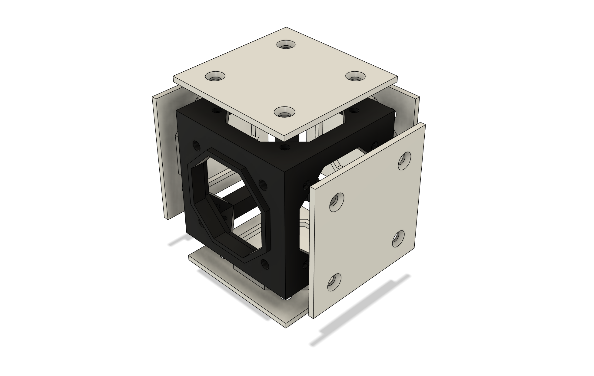

# Technology

# Body

Robots can take many forms.  [Spoke Body](/docs/spoke-body/spoke-body) is the system that permits robots to be constructed from open source, interchangeable, extendable parts.

# Compute

The critical core of the Robot is the main source of compute.  This is where larger AI algorithms run.  Typically these are Linux-based SBCs.

# Controllers

Inside the robot, local processing is handled by micro controllers.  These are connected to the main compute module via ethernet.  They are interconnected via micro network.

Where specialized processing is required, FPGAs can sometimes be the perfect solution.

# Peripherals

# Power

# Next

Want to get connected?

  <LinkButton href="/community" size="2">Community</LinkButton>