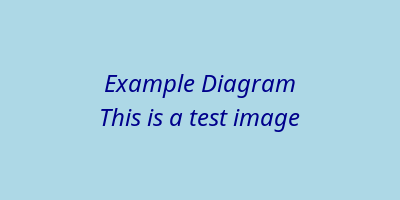

# Getting Started

Welcome to your new Next.js static site! This template provides a solid foundation for building modern, fast, and beautiful static websites.

## Features

This site includes:

- **Next.js App Router** with static export capability
- **Tailwind CSS** for styling with custom design tokens
- **shadcn/ui** components for consistent UI elements
- **Three.js integration** for 3D graphics and animations
- **Mermaid diagrams** with automatic theming
- **Markdown support** with Git submodules
- **GitHub Pages deployment** ready

## Quick Start

1. Clone this repository
2. Install dependencies: `npm install`
3. Start development server: `npm run dev`
4. Build for production: `npm run build`
5. Export static files: `npm run export`

## Project Structure

```
app/                    # Next.js App Router pages
components/            # Reusable React components
  ui/                 # shadcn/ui components
lib/                  # Utility functions and helpers
styles/               # Global CSS and Tailwind config
docs-test/           # Git submodule for documentation
public/               # Static assets
```

## Customization

### Theme Colors

Edit the CSS variables in `styles/globals.css` to customize your theme:

```css
:root {
  --brand: 221 83% 53%;
  --bg: 0 0% 100%;
  --fg: 222.2 84% 4.9%;
}
```

### Adding Content

Place your Markdown files in the `docs-test` directory. The site will automatically discover and render them.

## Mermaid Example

Here's a simple flowchart showing the development workflow:

```mermaid
flowchart LR
    A[Write Code] --> B[Test Locally]
    B --> C{Tests Pass?}
    C -->|Yes| D[Build & Export]
    C -->|No| A
    D --> E[Deploy to GitHub Pages]
```

## Images

You can include images in your documentation. Place them in the `docs-test/images/` directory:



## Next Steps

- Explore the [Three.js examples](/three)
- Check out the [Mermaid diagrams](/mermaid)
- Customize the theme colors and components
- Add your own content to the submodule
- Deploy to GitHub Pages
