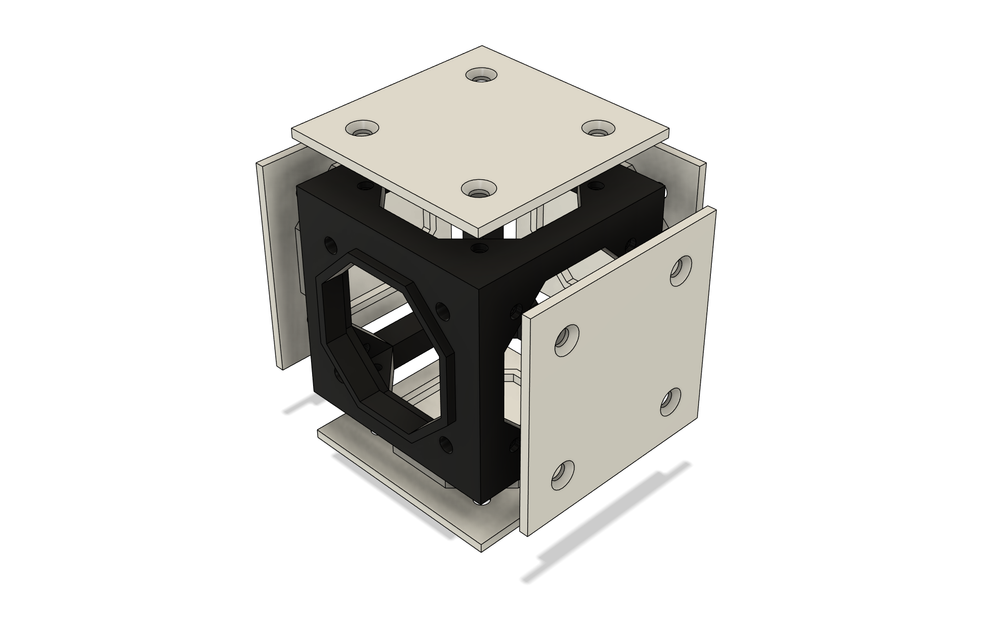

# SPOKE BODY 

# Big Picture

Spoke Body is the body of the Spoke project.  It is designed as a starting point for a diverse range of projects.

For any robotics project, the body has many roles:
- provide the structure of the robot
- provide a mounting mechanism for the sensors, mechatronics, battery, processors, etc.
- provide protection for all of the above

For any particular robot a custom solution can be invented.  But to be more useful a system can be developed that makes choices for all the big questions.

# The Design

At the core of the design is the frame.  It is created in modular sections.  There might be a core section, then perhaps front and rear sections and so on.

The frame is an open structure inside permitting maximum unobstructed space.  It is designed to completely enclose robot internals including wiring.

Panels are screwed into the frame in such a way as to not interfere with each other.

Panels serve multiple purposes, for example, to: 
- protect the content
- provide a way to mount things inside the robot
- make robot internals easily accessible
- lend additional rigidity to the frame
- mount touch sensors

All the design resources for these parts are parameterized for total customization, however, if reusability is a goal, then these parameters are assigned - somewhat arbitrarily into sets of standard values.  For example one set of values might be as follows:

- small side: 48mm
- large side: 96mm
- beam width: 6mm
- screw size: M3
- (and several others)

Note that the side dimensions are chosen to be nicely divisable into even numbers.  For example 48mm is 2 * 2 * 2 * 2 * 3, so it can be divided by 3 once and 2 many times.  96mm is just twice that.

The 6mm beam width gives a fairly rigid structure in many materials at the dimensions above.

And another, smaller set might be:

- small side: 32mm
- medium side: 64mm
- large side: 128mm
- beam width: 4mm
- screw size: M2
- (and several others)

This is a more delicate structure, lighter, perhaps suitable to robot limbs or other smaller robot parts.

There is nothing fixed about these values, but selecting a set can help with compatibility and reuse.

# Customization

This design is a starting point.  Used directly it can give a quick way into building robot frames, but it's not exclusive.  Using a frame, for example, by conforming only to the interface, new panels can be designed that do new kinds of things in new ways.

New frames can be designed with all kinds of different geometries.  If they conform to the frame-to-frame interconnect, they can connect to existing frames.  If they adopt the panel interfaces they can work with existing panels.

This is the frame and a couple of panels for the Dual Wheel Bot.  The frame parts (core, two main wheel mounts and the rear wheel mount) are all connected together. The panels have rails to hold PCBs.  

Note the different frame shapes.  The core is a simple cuboid (96 x 96 x 48mm), and the other parts are more complex, but where they all meet are standard sides of 96mm x 48mm.

# Sides

Sides are the building blocks of the system.  They're complex enough that it isn't ideal to recreate them each time, so they are designed separately.   

In CAD, sides are designed as sketches.  These sketches capture the core features of each side.  

# Next

See the [Side](/docs/spoke-body/side) documentation 
